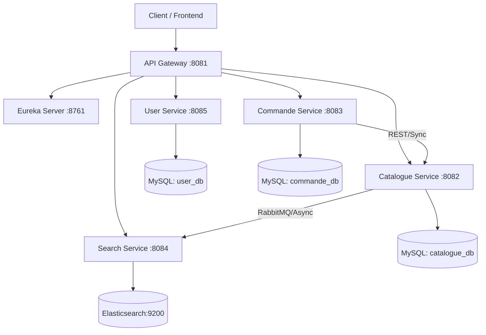

# E-Commerce Microservices Project

## 1. Project Overview & Objectives (Cahier des Charges)

### Objective
The goal of this project is to implement a modular **E-commerce Application** based on a **Microservices Architecture**. The system consists of distinct, communicating services that handle specific business domains, exposing REST APIs and utilizing event-driven patterns where appropriate.

### Core Modules
1.  **Catalogue Service:** Management of products, categories, and brands. Acts as the source of truth for item details.
2.  **Search Service:** Advanced search and filtering capabilities (powered by Elasticsearch).
3.  **Commande Service (Order Service):** Management of customer shopping carts and order processing.
4.  **User Service:** Authentication and user management.
5.  **Infrastructure:** Service Discovery (Eureka) and API Gateway.

### Future Extensions
*   **Recommendation Service:** Personalized product suggestions.

---

## 2. Technical Architecture

The project is built using the **Spring Boot** ecosystem for the backend and **React (Vite)** for the frontend.

### Technology Stack
*   **Backend:** Java, Spring Boot, Spring Cloud (Gateway, Eureka, OpenFeign/RestTemplate).
*   **Databases:**
    *   **MySQL:** Relational data for User, Catalogue, and Order services.
    *   **Elasticsearch:** Indexed data for high-performance searching.
*   **Messaging:** RabbitMQ (for asynchronous event propagation, e.g., Product Created -> Search Index Update).
*   **Frontend:** React.js, Vite, Tailwind CSS.
*   **Containerization (Optional):** Docker Compose support provided.

### System Diagram


---

## 3. Microservices Details

### 🟢 Service Discovery (Eureka)
*   **Port:** `8761`
*   **Role:** Service registry. All other services register here to be discoverable by name.

### 🌐 API Gateway
*   **Port:** `8081`
*   **Role:** Single entry point for all client requests. Handles routing, load balancing, and centralizing cross-cutting concerns (CORS, auth headers).
*   **Key Routes:**
    *   `/api/v1/products/**` -> Catalogue Service
    *   `/api/v1/search/**` -> Search Service
    *   `/api/v1/cart/**` & `/api/v1/orders/**` -> Commande Service
    *   `/auth/**` & `/api/v1/users/**` -> User Service

### 📦 Catalogue Service
*   **Port:** `8082`
*   **Database:** MySQL (`catalogue_db`)
*   **Responsibilities:** 
    *   CRUD operations for Products, Brands, and Categories.
    *   Image uploads (stored locally in `uploads/`).
    *   **Event Publishing:** Sends `ProductCreatedEvent` to RabbitMQ when new items are added.

### 🔍 Search Service
*   **Port:** `8084`
*   **Database:** Elasticsearch (`http://localhost:9200`)
*   **Responsibilities:**
    *   Provides full-text search and filtering endpoints.
    *   **Event Listening:** Listens to RabbitMQ to keep the Elasticsearch index in sync with the Catalogue.

### 🛒 Commande Service (Order Service)
*   **Port:** `8083`
*   **Database:** MySQL (`commande_db`)
*   **Responsibilities:**
    *   Manages Shopping Carts (Items, Quantities).
    *   Processes Orders.
    *   **Dependencies:** Synchronously calls `catalogue-service` to validate product existence, price, and stock availability before adding items to the cart.

### 👤 User Service
*   **Port:** `8085`
*   **Database:** MySQL (`user_db`)
*   **Responsibilities:**
    *   User Registration and Login.
    *   JWT Token generation and validation.

---

## 4. Setup & Installation

### Prerequisites
*   **Java JDK 17+**
*   **Maven**
*   **MySQL Server** (running on default port 3306)
*   **Elasticsearch** (running on default port 9200)
*   **RabbitMQ** (running on default port 5672)
*   **Node.js & npm** (for Frontend)

### Step 1: Database Setup
Execute the SQL scripts found in the `Data/` folder to initialize your MySQL databases:
1.  `Data/user_db.sql`
2.  `Data/catalogue_db.sql`
3.  `Data/commande_db.sql`

### Step 2: Backend Startup Order
Run the services in the following order to ensure dependencies are met:
1.  **Service Discovery** (`service-discovery`)
2.  **API Gateway** (`api-gateway`)
3.  **User Service** (`user-service`)
4.  **Catalogue Service** (`catalogue-service`)
5.  **Search Service** (`search-service`)
6.  **Commande Service** (`commande-service`)

*Command (in each service folder):* `mvn spring-boot:run`

### Step 3: Frontend Setup
Navigate to the `frontend` directory:
```bash
cd frontend
npm install
npm run dev
```
The application will be accessible at `http://localhost:5173`.

---

## 5. Directory Structure
```
ecommerce-microservices/
├── api-gateway/          # Spring Cloud Gateway
├── catalogue-service/    # Product Management
├── commande-service/     # Orders & Cart
├── Data/                 # SQL Initialization scripts
├── frontend/             # React Application
├── search-service/       # Elasticsearch integration
├── service-discovery/    # Eureka Server
├── uploads/              # Shared storage for uploaded images
└── user-service/         # Authentication & Users
```
